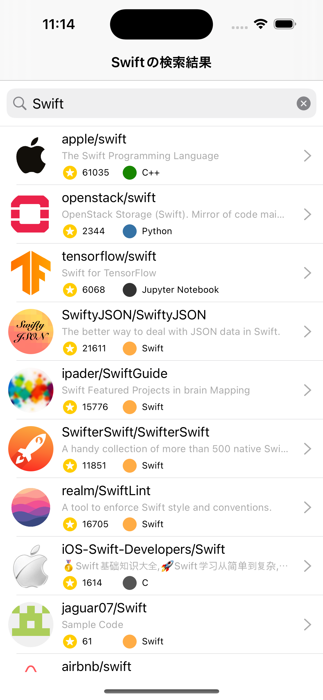
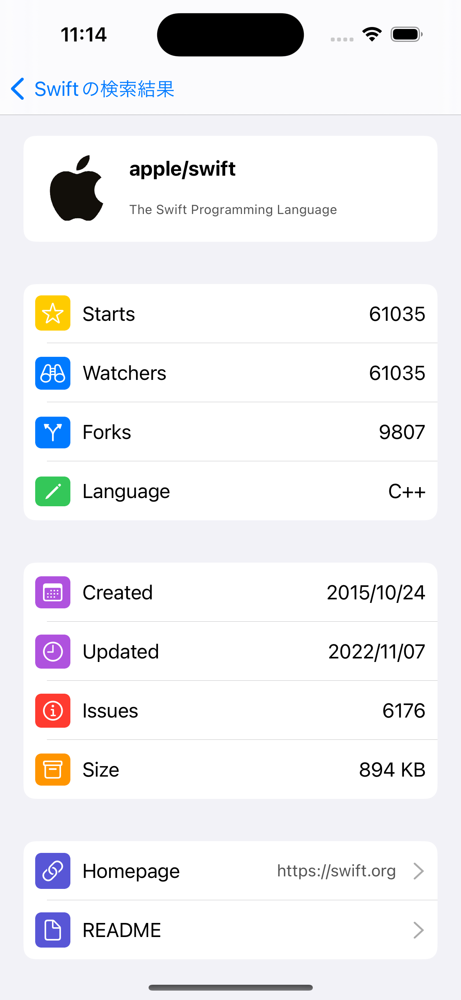
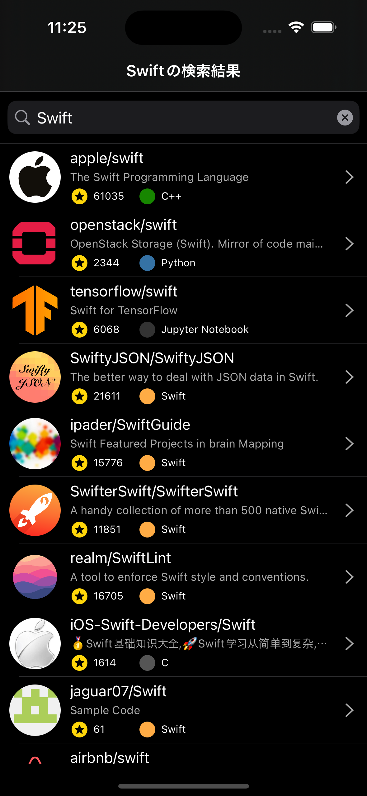
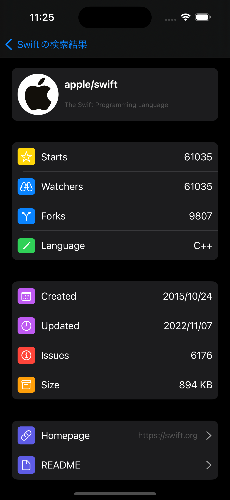
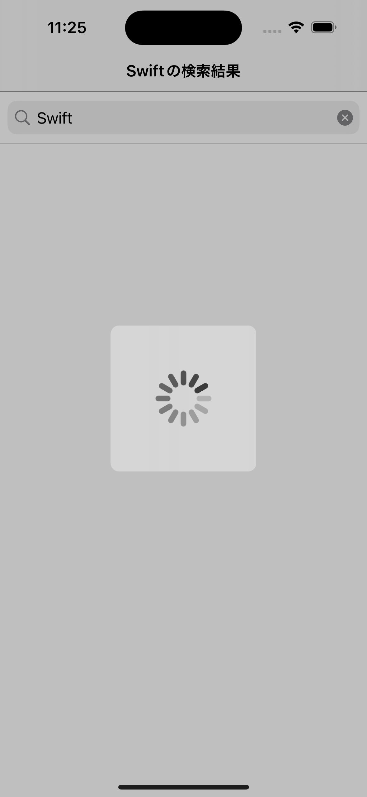
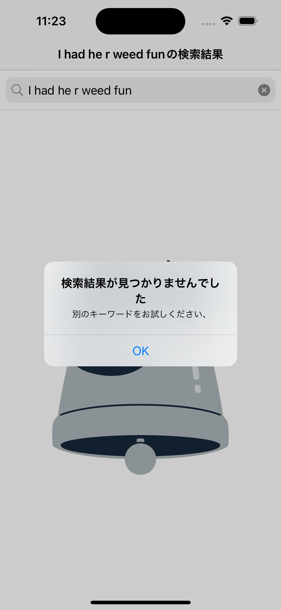
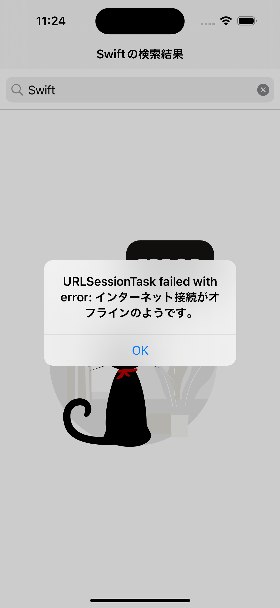

# 株式会社ゆめみiOSエンジニアコードチェック課題

## 概要

株式会社ゆめみコードチェック課題です。  
概要レポジトリ: https://github.com/yumemi-inc/ios-engineer-codecheck.git

## 開発概要

### 開発環境

- M1 macOS Monterey 12.6
- Xcode 14.0.1
- Swift 5.7

### ライブラリ管理ツール

- [x] Swift Package Manager
- [ ] CocoaPods
- [ ] Carhage

### 使用したライブラリ

| ライブラリ名 | 用途 |
| :----------: |:----:|
| [RxSwift](https://github.com/ReactiveX/RxSwift.git) | MVVMを実現するために使用 |
| [Moya](https://github.com/Moya/Moya.git) | API通信の実装を楽にするために使用 |
| [Kingfisher](https://github.com/onevcat/Kingfisher.git) | ユーザの画像を表示するために使用 |
| [Lottie](https://github.com/airbnb/lottie-ios.git) | アニメーションを実装するために使用 |
| [PKHUB](https://github.com/pkluz/PKHUD.git) | ロードアニメーションを実装するために使用 |

### 採用したアーキテクチャ

`MVVMアーキテクチャ(sergdort)`を採用した。採用した理由は、自分が最も使い慣れたアーキテクチャであり、一番実力が発揮できると考えたからである。MVVMアーキテクチャを実現するにあたり、`RxSwift`ライブラリを使用した。

- 参考書籍
    - [iOSアプリ設計パターン入門](https://peaks.cc/books/iOS_architecture)
    - [RxSwift研究読本3 ViewModel設計パターン入門](https://swift.booth.pm/items/1223536)
- 参考レポジトリ
    - [sergdort/CleanArchitectureRxSwift](https://github.com/sergdort/CleanArchitectureRxSwift.git)
    - [ryu1sazae/Sergdort-MVVM-Practice](https://github.com/ryu1sazae/Sergdort-MVVM-Practice.git)

### Git管理

- ブランチ管理は、`Git-Flow`を採用
- コミットメッセージは以下の通り

| コミットメッセージ | 用途 |
|:------------------:|:----:|
| add | ファイルの追加(最低限の実装込み) |
| feat | 機能の追加 |
| delete | ファイルやコードの削除 |
| rename | ファイル名や関数名、変数名の変更 |
| fix | バグやタイプミスを修正 |
| refactor | 仕様には影響がないコード改善 |

- 参考記事
    - [僕が考える最強のコミットメッセージの書き方](https://qiita.com/konatsu_p/items/dfe199ebe3a7d2010b3e) 
    - [Gitのコミットメッセージの書き方](https://qiita.com/itosho/items/9565c6ad2ffc24c09364)

### アピールポイント
- API周り
    - Moyaライブラリを使って、できるだけシンプルに記述した。
    - テストがしやすいように、protocolやコンストラクタを利用した。
    - レスポンスのステータスコードによって、エラーを判別できるようにした。
- UI/UX
    - `API通信中`は、ロードのアニメーションが表示されるようにした。
    - `エラーが起きた時`は、エラーのアニメーションとアラートが表示されるようにした。
    - `検索結果が0`だったら、専用のアニメーションとアラートが表示されるようにした。
    - `検索画面`から、一目でスター数と使用言語がわかるようにした。
    - `詳細画面`は、iPhoneの設定画面を参考に作成した。
    - またホームページやREADMEの有無によって、各Cellが表示されるようにした。
- テスト
    - UIテストは`PageObjectPattern`を採用した。
    - `RxTest`や`RxBlocking`を使用して、非同期処理のテストをシンプルに記述した。
    - `Mock`を利用して、ViewModelとModelを分離してテストした。
    - `XCTContent`を使用して、構造をわかりやすくした。

### 参考にした記事
各PRに記載。

## アプリ概要

### 動作イメージ
| Lightモード | Darkモード |
| :---------: | :--------: |
| | 

### 画面詳細
#### Lightモード
| 検索前 | 検索後 | 詳細画面 |
|:------:| :-----:| :-------:|
||  | 

#### Darkモード
| 検索前 | 検索後 | 詳細画面 |
|:------:| :-----:| :-------:|
||  | 

#### その他

| ロード中 | 検索結果0 | 通信エラー |
| :----:| :------: | :-----: |
|  |  |  |
